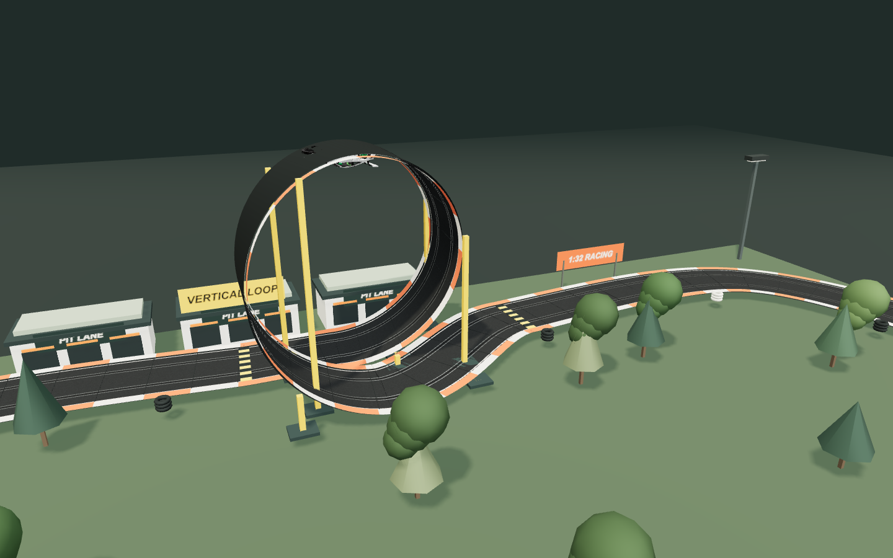
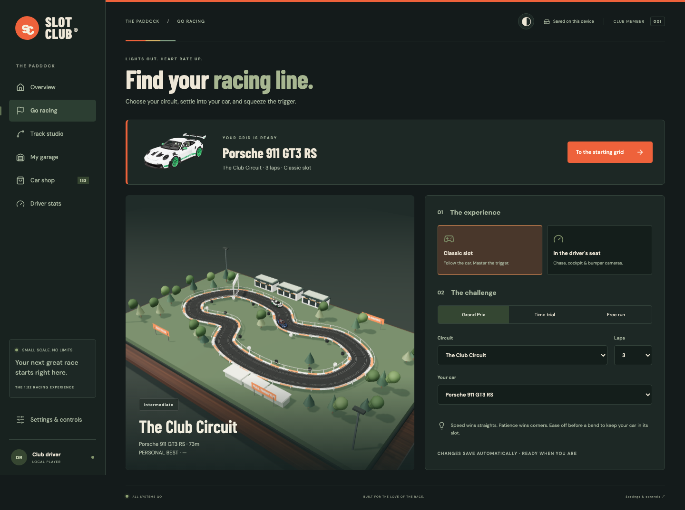
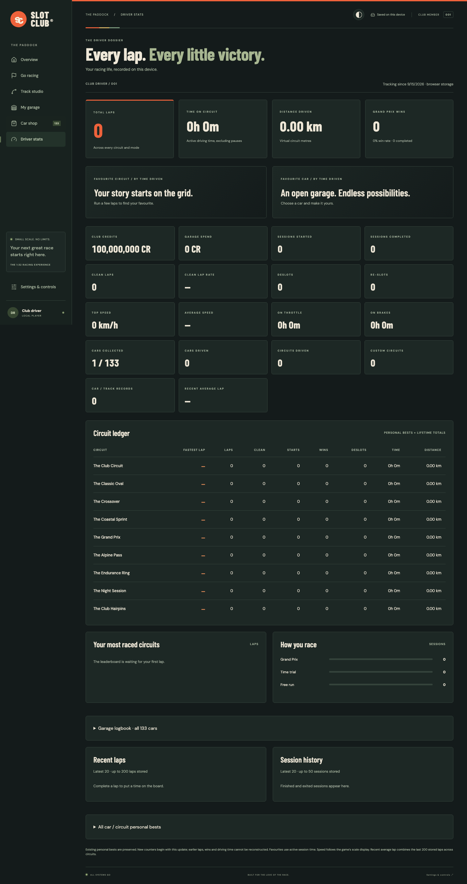

# SLOT CLUB
### Small cars. Big racing.

A miniature motorsport playground. Build a circuit, collect your favourite cars, and find the limit of the slot.

**[PLAY IN YOUR BROWSER ↗](https://scalextric-chi.vercel.app/)**

 

## The feeling of a real slot-car set

The guide slot keeps you on the racing line. Your job is to judge the throttle.

Accelerate down the straights, ease off through the corners, and watch the grip meter as the car approaches its limit. Brief spikes in cornering force give you room to recover. Sustained overspeed sends the car out of its slot, with a tumble and a 2.5–3.5-second crew repair before automatic re-slotting. The race clock and your rival keep going.

The circuit sits on a miniature tabletop, complete with moulded track sections, twin slots, metallic power rails, textured asphalt, borders, crash barriers, pit garages, tyre stacks, trees, signs, bridge supports, and lighting rigs.

<table>
<tr>
<td width="50%"> <strong>Get closer to the racing.</strong> Chase, cockpit, bumper, and classic tabletop cameras.</td>
<td width="50%"> <strong>Stay for the night session.</strong> Floodlit track surfaces and an after-dark atmosphere.</td>
</tr>
</table>

## A garage worth coming back to

133 detailed, downloadable 3D car models fill the garage. Each has its own silhouette, bodywork, wheels, glass, materials, and handling characteristics. The garage thumbnails are rendered from the same models used on the track.

**Modern icons meet the poster-car years.** Porsche 911 GT3 RS, Mustang Mach 1, McLaren P1 GTR, Mini Cooper S, Aston Martin DB11 and BMW M4 join the F40, Countach, Stratos, Sport Quattro, M1, 787B, Supra, NSX-R, XJ220, 300 SL, Golf GTI, 930 Turbo, Esprit V8 and 250 GTO.

Search by name, filter by era or performance class, sort by price or name, and browse 24 cars at a time.

Every local profile starts with **100,000,000 club credits** — enough to buy the entire collection. Prices run from **8,000 CR** to **600,000 CR**. No checkout. No real money. No account required.

Seven segmented ratings show **top speed, acceleration, cornering, braking, stability, jump control and downforce**. Higher price classes improve every rating; cars within a class have different strengths. The displayed ratings feed the actual racing physics. These are gameplay ratings, not manufacturer performance data.

[Browse the original model sources and artists →](https://scalextric-chi.vercel.app/credits.html)

## Fourteen starting lines. Your own next.

| Circuit | Character |
| :--- | :--- |
| **The Club Circuit** | The all-rounder: fast straights and technical corners |
| **The Classic Oval** | A simple circuit for finding your rhythm |
| **The Crossover** | An elevated crossing and two demanding loops |
| **The Coastal Sprint** | Open straights and generous sweeping bends |
| **The Grand Prix** | A pit straight, stadium loop, and technical infield |
| **The Alpine Pass** | Elevation changes and a forest hairpin |
| **The Endurance Ring** | A fast outer loop with an infield challenge |
| **The Night Session** | Floodlit racing after dark |
| **The Club Hairpins** | Short straights and tight return bends |
| **Switchback Speedway** | Two lane-swapping crossovers |
| **Airborne Arena** | Twin ramp jumps with open gaps |
| **Loop Laboratory** | A full vertical loop with separated entry and exit rails |
| **Collision Junction** | A ground-level intersection with shared track space |
| **Stunt Club Supercourse** | A loop, crossover and jump in one lap |

### Take it off the flat

Jump control widens your safe takeoff-speed range. Too slow or too fast means a missed landing. Downforce helps hold the car to the loop, but you still need momentum over the top. Driver cameras turn with the car through the inversion.

Crossovers exchange lanes; intersections create shared ground-level crossing points. Cars can collide there, while a raised bridge keeps them apart. Hazard stripes mark the stunt sections. Your race briefing shows the speed guidance for your selected car.

Use **Pit / B** on a clear section for a three-second breather. Crash repairs take **2.5–3.5 seconds**, pause with the game, and return you automatically. Failed jumps and loops return you to an approach checkpoint so you can build momentum again.

### Your track. Your rules.

Track Studio lets you shape a closed circuit, insert straight, curved, and chicane sections, add borders and a bridge, clip in crossovers, intersections, jumps and loops, reposition or remove stunt pieces, undo changes, and save the result to your collection. The editor uses a continuous spline through editable control points; it is a creative circuit builder rather than an exact physical-parts catalogue.

## The night paddock

Warm cream, racing orange and deep green. Switch between **Night paddock**, **Classic cream**, or your device’s theme. The original Slot Club monogram now appears in browser tabs, with a matching racing poster when you share the site.

Start a **Quick race** from the home screen using your saved settings, or use the race ticket to pick a circuit, car, mode and lap count. Model loading and graphics warm-up happen before lights out.

## Your driver dossier

A dedicated stats page keeps your circuit and garage logbooks: fastest laps, total and clean laps, driving time, distance, wins, win rate, deslots, re-slots, top and average speed, throttle and brake time, favourite car and circuit, local credits, garage spending, recent laps and session history. Jump attempts, successful landings, loops cleared, collisions, pit stops and pit time are tracked too. Track and car tables make it easy to compare your progress.

Existing personal bests are retained. New counters start with this update; older driving totals cannot be reconstructed. Everything remains in browser storage and travels with save exports.

## Set the soundtrack

Layered engine audio follows the throttle, revs and gear shifts, with softened high frequencies and its own volume slider. Engines stop at the finish, during repairs and when paused.

The **♫ Music OFF** button in the header and race controls enables an original retro synth soundtrack. Music starts off by default; its toggle and separate volume setting save in your browser. Leaving the tab silences both channels.

## Race your way

| Experience | What’s on the grid |
| :--- | :--- |
| **Classic slot** | A following tabletop camera and a virtual throttle controller |
| **Driver view** | Chase, cockpit, and bumper perspectives |
| **Grand Prix** | An AI rival over 3, 5, or 10 laps |
| **Time trial** | A personal best waiting to be beaten |
| **Free run** | Unlimited laps to learn the track |

## Built for a quick race

- **Desktop and mobile:** responsive menus, touch controls, and a touch-friendly track editor.
- **Your collection stays with you:** cars, custom circuits, personal bests, and preferences save in browser storage.
- **Backups included:** export and import your save from Settings.
- **Detail with a budget:** compressed models loaded only when selected, lighter geometry in adaptive/performance modes, GPU-compressed textures where provided, a bounded model cache, batched scenery, cached static shadows and adaptive resolution.
- **Pause when life happens:** the race pauses when you leave the tab.

Saves are local to the browser and site address. Cloud accounts and database storage are planned for a later stage.

---

<strong>Meet the model artists · attribution and licences</strong>

 

These are detailed community-made representations of real cars, not manufacturer CAD files. The garage names match the actual assets used.

| Model | Artist | Licence |
| :--- | :--- | :--- |
| [2023 Porsche 911 GT3 RS 2.7 Carrera Tribute](https://sketchfab.com/3d-models/2023-porsche-911-gt3-rs-27-carrera-tribute-992-f17a982d5d8a4d97baef4b00b51a4e9a) | Ddiaz Design | [CC BY-NC-SA 4.0](https://creativecommons.org/licenses/by-nc-sa/4.0/) |
| [1969 Ford Mustang Mach-1 428 Cobra Jet](https://sketchfab.com/3d-models/1969-ford-mustang-mach-1-428-cobra-jet-679cdf81b9854759860b0afe9d1e4012) | Ddiaz Design | [CC BY-NC-SA 4.0](https://creativecommons.org/licenses/by-nc-sa/4.0/) |
| [McLaren P1 GTR](https://sketchfab.com/3d-models/free-mclaren-p1-gtr-d805bec04cf5407fa7c036c20c726d39) | Desiccated_Lemon | [CC BY 4.0](https://creativecommons.org/licenses/by/4.0/) |
| [Mini Cooper S](https://sketchfab.com/3d-models/mini-cooper-s-2baca439d2494e02b99596014b49ebd3) | GT Cars | [CC BY 4.0](https://creativecommons.org/licenses/by/4.0/) |
| [2017 Aston Martin DB11](https://sketchfab.com/3d-models/2017-aston-martin-db11-52l-twin-turbo-v12-936854ba7dde46f09a47d355d433808c) | Hari31 | [CC BY 4.0](https://creativecommons.org/licenses/by/4.0/) |
| [BMW M4 Competition M Package](https://sketchfab.com/3d-models/bmw-m4-competition-m-package-5c0a2dafb1ad408d9fc9eeef9aee531b) | SRT Performance | [CC BY 4.0](https://creativecommons.org/licenses/by/4.0/) |

Models were simplified, merged, compressed, oriented, and scaled for browser use. WebP textures were resized; existing GPU-compressed KTX2 textures retain their source resolution. Optimised models and their renders retain their respective asset licences. Several derivatives require non-commercial use and/or share-alike; consult the full per-model credits. These asset licences do not relicense the game code or unrelated content.

The expanded models were sourced from [Marque’s model collection](https://github.com/JamieGeddes/marque/tree/main/public/models), with original Sketchfab metadata and licence files retained.

[Full in-game credits](https://scalextric-chi.vercel.app/credits.html) · [Machine-readable credits](public/models/credits.json)

 

**Built for the love of the race.**

[Enter the paddock ↗](https://scalextric-chi.vercel.app/)

Independent fan project. Not affiliated with Scalextric, Hornby, or vehicle manufacturers.

