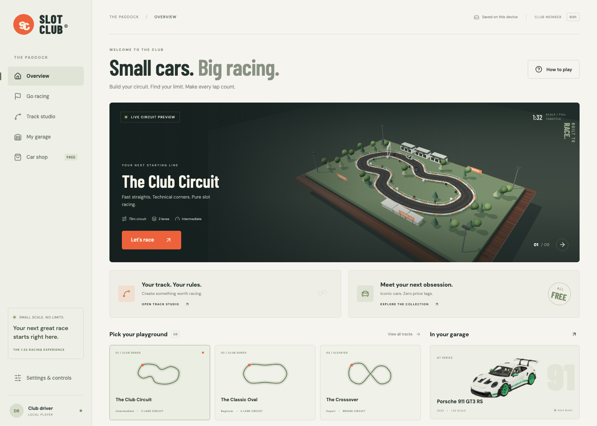
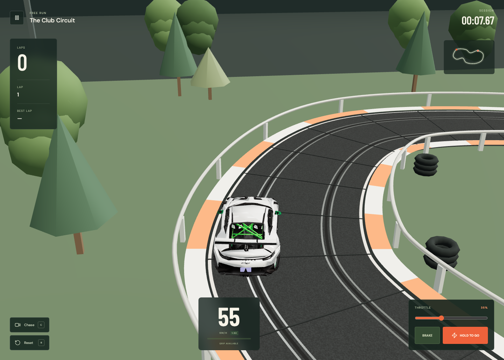
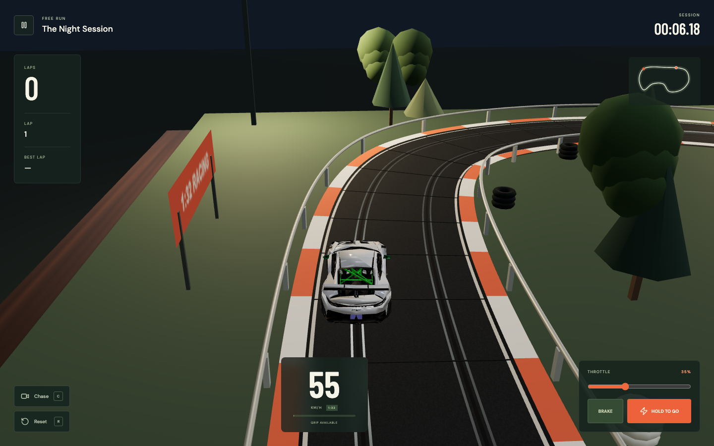
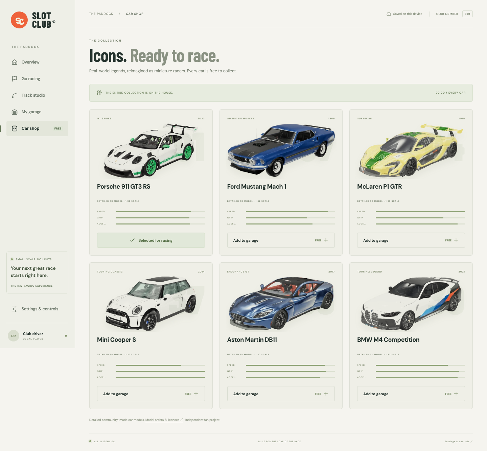
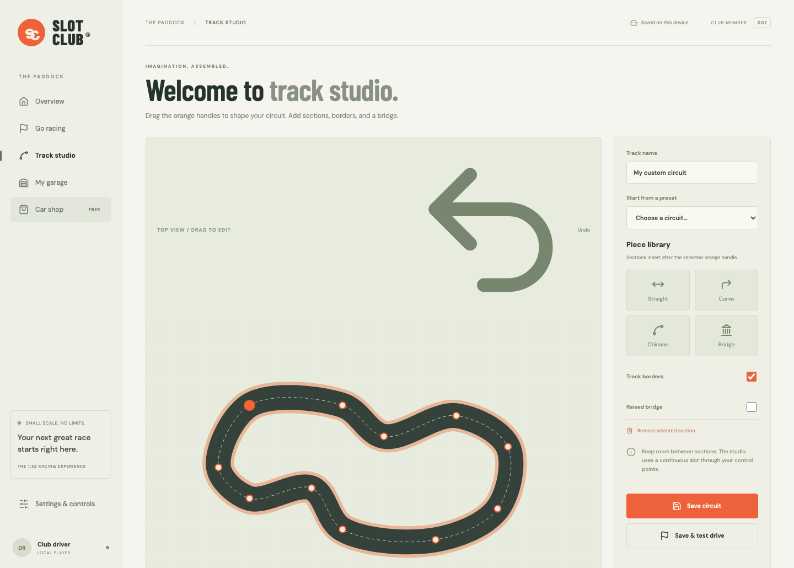

# SLOT CLUB
### Small cars. Big racing.

A miniature motorsport playground. Build a circuit, collect your favourite cars, and find the limit of the slot.

**[PLAY IN YOUR BROWSER ↗](https://scalextric-chi.vercel.app/)**

 

## The feeling of a real slot-car set

The guide slot keeps you on the racing line. Your job is to judge the throttle.

Accelerate down the straights, ease off through the corners, and watch the grip meter as the car approaches its limit. Brief spikes in cornering force give you room to recover. Sustained overspeed sends the car out of its slot, with a tumble and a quick re-slot to get you racing again.

The circuit sits on a miniature tabletop, complete with moulded track sections, twin slots, metallic power rails, textured asphalt, borders, crash barriers, pit garages, tyre stacks, trees, signs, bridge supports, and lighting rigs.

<table>
<tr>
<td width="50%"> <strong>Get closer to the racing.</strong> Chase, cockpit, bumper, and classic tabletop cameras.</td>
<td width="50%"> <strong>Stay for the night session.</strong> Floodlit track surfaces and an after-dark atmosphere.</td>
</tr>
</table>

## A garage worth coming back to

Six detailed, downloadable 3D car models replace the original block-shaped cars. Each has its own silhouette, bodywork, wheels, glass, materials, and handling characteristics. The garage thumbnails are rendered from the same models used on the track.

**Porsche 911 GT3 RS · Ford Mustang Mach 1 · McLaren P1 GTR · Mini Cooper S · Aston Martin DB11 · BMW M4 Competition**

Every car is free to collect. No checkout. No account required.

## Nine starting lines. Your own next.

| Circuit | Character |
| :--- | :--- |
| **The Club Circuit** | The all-rounder: fast straights and technical corners |
| **The Classic Oval** | A simple circuit for finding your rhythm |
| **The Crossover** | An elevated crossing and two demanding loops |
| **The Coastal Sprint** | Open straights and generous sweeping bends |
| **The Grand Prix** | A pit straight, stadium loop, and technical infield |
| **The Alpine Pass** | Elevation changes and a forest hairpin |
| **The Endurance Ring** | A fast outer loop with an infield challenge |
| **The Night Session** | Floodlit racing after dark |
| **The Club Hairpins** | Short straights and tight return bends |

### Your track. Your rules.

Track Studio lets you shape a closed circuit, insert straight, curved, and chicane sections, add borders and a bridge, undo changes, and save the result to your collection. The editor uses a continuous spline through editable control points; it is a creative circuit builder rather than an exact physical-parts catalogue.

## Race your way

| Experience | What’s on the grid |
| :--- | :--- |
| **Classic slot** | A following tabletop camera and a virtual throttle controller |
| **Driver view** | Chase, cockpit, and bumper perspectives |
| **Grand Prix** | An AI rival over 3, 5, or 10 laps |
| **Time trial** | A personal best waiting to be beaten |
| **Free run** | Unlimited laps to learn the track |

## Built for a quick race

- **Desktop and mobile:** responsive menus, touch controls, and a touch-friendly track editor.
- **Your collection stays with you:** cars, custom circuits, personal bests, and preferences save in browser storage.
- **Backups included:** export and import your save from Settings.
- **Detail with a budget:** compressed models, smaller mobile variants, shared model caching, batched scenery, and adaptive graphics quality.
- **Pause when life happens:** the race pauses when you leave the tab.

Saves are local to the browser and site address. Cloud accounts and database storage are planned for a later stage.

---

<strong>Meet the model artists · attribution and licences</strong>

 

These are detailed community-made representations of real cars, not manufacturer CAD files. The garage names match the actual assets used.

| Model | Artist | Licence |
| :--- | :--- | :--- |
| [2023 Porsche 911 GT3 RS 2.7 Carrera Tribute](https://sketchfab.com/3d-models/2023-porsche-911-gt3-rs-27-carrera-tribute-992-f17a982d5d8a4d97baef4b00b51a4e9a) | Ddiaz Design | [CC BY-NC-SA 4.0](https://creativecommons.org/licenses/by-nc-sa/4.0/) |
| [1969 Ford Mustang Mach-1 428 Cobra Jet](https://sketchfab.com/3d-models/1969-ford-mustang-mach-1-428-cobra-jet-679cdf81b9854759860b0afe9d1e4012) | Ddiaz Design | [CC BY-NC-SA 4.0](https://creativecommons.org/licenses/by-nc-sa/4.0/) |
| [McLaren P1 GTR](https://sketchfab.com/3d-models/free-mclaren-p1-gtr-d805bec04cf5407fa7c036c20c726d39) | Desiccated_Lemon | [CC BY 4.0](https://creativecommons.org/licenses/by/4.0/) |
| [Mini Cooper S](https://sketchfab.com/3d-models/mini-cooper-s-2baca439d2494e02b99596014b49ebd3) | GT Cars | [CC BY 4.0](https://creativecommons.org/licenses/by/4.0/) |
| [2017 Aston Martin DB11](https://sketchfab.com/3d-models/2017-aston-martin-db11-52l-twin-turbo-v12-936854ba7dde46f09a47d355d433808c) | Hari31 | [CC BY 4.0](https://creativecommons.org/licenses/by/4.0/) |
| [BMW M4 Competition M Package](https://sketchfab.com/3d-models/bmw-m4-competition-m-package-5c0a2dafb1ad408d9fc9eeef9aee531b) | SRT Performance | [CC BY 4.0](https://creativecommons.org/licenses/by/4.0/) |

Models were simplified, merged, texture-resized, compressed, oriented, and scaled for browser use. Optimised models and their renders retain their respective asset licences. Porsche and Ford derivatives are non-commercial and share-alike. These asset licences do not relicense the game code or unrelated content.

[Full in-game credits](https://scalextric-chi.vercel.app/credits.html) · [Machine-readable credits](public/models/credits.json)

 

**Built for the love of the race.**

[Enter the paddock ↗](https://scalextric-chi.vercel.app/)

Independent fan project. Not affiliated with Scalextric, Hornby, or vehicle manufacturers.

